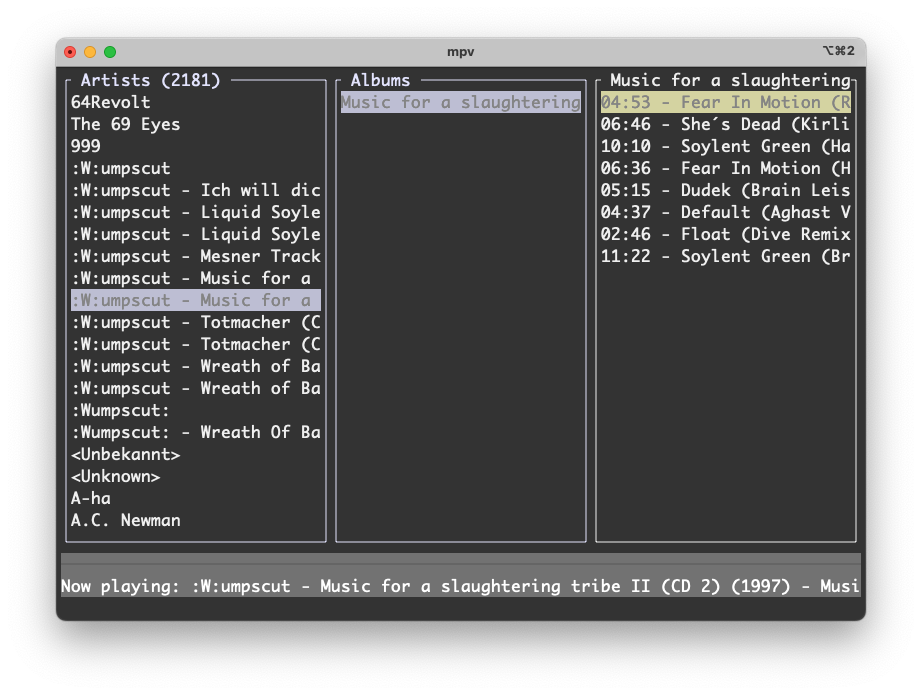

# TerminalDrome - Navidrome Terminal Client (PowerMac G5 Edition)


**TerminalDrome** ist ein kleines und schneller, schmaler *Navidrome Client* für **betagte Systeme**. Ich hatte ganz konkret meinen Powermac G5 (den Legendären) im Blick, auf dem zwar ein aktuelles Linux läuft, wohl aber die betagte Hardware von 2005 nicht mehr alles zulässt. Und so habe ich mir einen kleinen Terminal Client in Rust geschrieben, mit dem ich auf meinen persönlichen Navidrome Server zugreifen kann. Er ist *Subsonic* API Kompatibel.



# aktueller Stand

An diesen wichtigsten Korrekturen und Verbesserungen arbeite ich gerade:

* Player-Status-Update: Die update_now_playing-Methode wurde korrigiert, um nur dann zu aktualisieren, wenn sich der Index tatsächlich geändert hat.
* MPV-Listener-Task: Der Task, der die MPV-Ausgabe überwacht, wurde stabilisiert und der Socket-Handling wurde verbessert.
* Doppelte Song-URLs: Die doppelte Hinzufügung von Songs in der start_playback-Methode wurde entfernt.
* Fehlerbehandlung: Die start_playback-Methode gibt nun ein Result zurück und behandelt den Fall, dass keine Songs vorhanden sind.
* Player-Status-Reset: Beim Stoppen der Wiedergabe wird der Player-Status jetzt korrekt zurückgesetzt.
* Main-Loop: Die Hauptschleife wurde optimiert, um regelmäßig den Now-Playing-Status zu aktualisieren.

Diese Änderungen sollten dazu führen, dass:

* Der gelbe Streifen (Now-Playing-Markierung) sich automatisch bewegt
* Das Now-Playing-Panel aktualisiert wird
* Der Zustand beim Start korrekt wiederhergestellt wird
* Die Wiedergabe nahtlos fortgesetzt wird

## 🎯 Ziel
- Bei Auswahl eines Songs soll das ganze Album danach abgespielt werden
- Musikstreaming im Terminal ohne moderne Browser
- Ultra-leichtgewichtige Alternative für Ressourcen-beschränkte Systeme
- Rust-basiert für maximale Performance

## ⚠️ Aktueller Status
**Experimentell** - Grundfunktionen sind implementiert, aber:
- [ ] Playback funktioniert stabil
- [ ] Fehlerbehandlung benötigt Verbesserungen
- [ ] UI ist sehr basic, 3 Panes.

## 🛠️ Kompatibilität
| System       | Arch     | Status      |
|--------------|----------|-------------|
| PowerMac G5  | ppc64    | ✅ Getestet |
| Mac Mini Mx  | aarch64  | ✅ Getestet |
| Macbook Pro 2016  | x86-64  | ✅ Getestet |

## 🚀 Installation
1. Voraussetzungen:
   ```bash
   sudo pacman -S mpv git rustup  # Für Arch Linux ppc64
   rustup target add ppc64-unknown-linux-gnu

2. Bauen:
	```bash
	git clone https://github.com/thafaker/termnavi.git
	cd termnavi
	cargo build --release

3. Konfiguration (~/.config/termnavi/config.toml):
	```bash
	[server]
	url = "https://dein.navidrome.server"
	username = "dein_benutzername"
	password = "dein_passwort"

## 🎛️ Bedienung

Tastenkürzel  |	Aktion  		 |
---------|-------------------------------|
↑/↓	 |	Navigation		 |
ENTER |	Titel abspielen		 |
Leertaste | Titel stoppen          |
Q	 |	Beenden			 |

### Verhalten
▶️ Ein neuer Song stoppt automatisch den aktuellen

⏹️ Leertaste stoppt die Wiedergabe sofor

🚫 Keine überlappenden Player-Instanzen

📡 Klare Statusmeldungen im unteren Bereich

## 💻 Entwicklung

Mithelfen ist willkommen! Besonders bei:

* Audio-Playback auf ppc64
* Bessere TUI mit Ratatui
* Navidrome API-Integration
