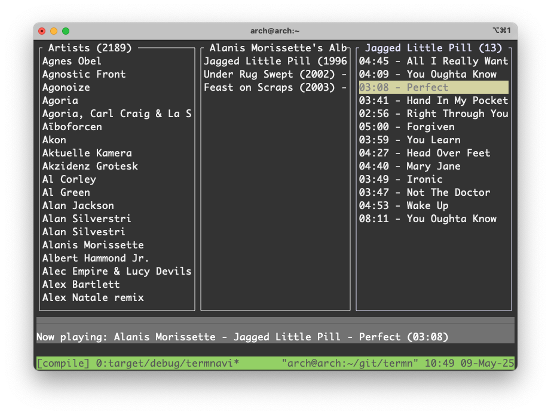

# TermNavi - Navidrome Terminal Client (PowerMac G5 Edition)


Ein minimalistischer Terminal-Client für [Navidrome](https://www.navidrome.org/), speziell optimiert für ältere Hardware wie PowerMac G5 (ppc64) und moderne ARM-Systeme (aarch64).



# aktueller Stand
* 08.05.2025 - Lauffähig, spielt und stoppt Songs. Auf PowerPC (ppc64) und Mac Mini M4 (aarch64) via Homebrew.

## 🎯 Ziel
- Musikstreaming im Terminal ohne moderne Browser
- Ultra-leichtgewichtige Alternative für Ressourcen-beschränkte Systeme
- Rust-basiert für maximale Performance

## ⚠️ Aktueller Status
**Experimentell** - Grundfunktionen sind implementiert, aber:
- [ ] Playback funktioniert stabil
- [ ] Fehlerbehandlung benötigt Verbesserungen
- [ ] UI ist sehr basic, 3 Panes.

## 🛠️ Kompatibilität
| System       | Arch     | Status      |
|--------------|----------|-------------|
| PowerMac G5  | ppc64    | ✅ Getestet |
| Mac Mini Mx  | aarch64  | ✅ Getestet |
| Macbook Pro 2016  | x86-64  | ⚠️ offen |

## 🚀 Installation
1. Voraussetzungen:
   ```bash
   sudo pacman -S mpv git rustup  # Für Arch Linux ppc64
   rustup target add ppc64-unknown-linux-gnu

2. Bauen:
	```bash
	git clone https://github.com/thafaker/termnavi.git
	cd termnavi
	cargo build --release

3. Konfiguration (~/.config/termnavi/config.toml):
	```bash
	[server]
	url = "https://dein.navidrome.server"
	username = "dein_benutzername"
	password = "dein_passwort"

## 🎛️ Bedienung

Tastenkürzel  |	Aktion  		 |
---------|-------------------------------|
↑/↓	 |	Navigation		 |
ENTER |	Titel abspielen		 |
Q	 |	Beenden			 |

### Verhalten
▶️ Ein neuer Song stoppt automatisch den aktuellen
⏹️ Leertaste stoppt die Wiedergabe sofort
🚫 Keine überlappenden Player-Instanzen
📡 Klare Statusmeldungen im unteren Bereich

## 💻 Entwicklung

Mithelfen ist willkommen! Besonders bei:

* Audio-Playback auf ppc64
* Bessere TUI mit Ratatui
* Navidrome API-Integration
