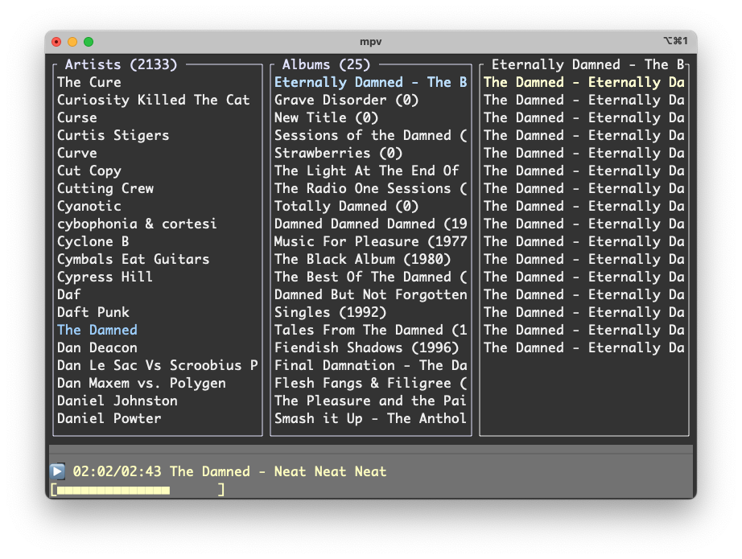

# TerminalDrome - Terminalbasierter Navidrome Client


**TerminalDrome** ist ein schlanker Subsonic-API-kompatibler Musikclient für Terminal-Umgebungen, optimiert für ältere Hardware wie den PowerMac G5. 



## Stand:
* absolute pre Alpha!!!
* Scrobbling zu last.fm und listen.brainz funktioniert über Navidrome
* Titel aktualisiert sich beim Spielen. Ist ein Song zu Ende wechselt er automatisch zum nächsten Song und zeigt dies auch an. Update Zeit und Song funktioniert.
* Wir sind jetzt in Beta.

## ✨ Features
- **Vintage-optimiert**: Läuft selbst auf 20+ Jahre alter Hardware (PowerPC G5)
- **Ressourcensparend**: <5MB RAM-Verbrauch, keine GPU-Anforderungen
- **Sofortstart**: Keine komplexen Abhängigkeiten, nur MPV benötigt
- **Smartes Playback**:
  - Fortschrittsbalken mit Echtzeit-Update
  - Automatische Albumwiedergabe nach Titelauswahl
  - Zustandserhaltung zwischen Sitzungen
- **Intuitive TUI**:
  - Drei-Panel-Interface (Künstler → Alben → Titel)
  - Farbige Statusanzeigen
  - Tastaturgesteuerte Navigation

## 🖥️ Kompatibilität
| System          | Arch     | Status      |
|-----------------|----------|-------------|
| PowerMac G5     | ppc64    | ✅ Stabil   |
| Raspberry Pi 4  | aarch64  | ✅ Stabil   |
| Moderne Laptops | x86-64   | ✅ Getestet |
| Mac mini M4 | arm64   | ✅ Getestet |

## 📦 Installation

### Voraussetzungen
- **MPV** (mind. 0.34+)
- **Rust Toolchain** (nur für Eigenkompilierung)

#### Paketmanager-Installation MPV:
| Distribution | Befehl |
|--------------|--------|
| Ubuntu/Debian | `sudo apt install mpv` |
| Arch Linux/Manjaro | `sudo pacman -S mpv` |
| Fedora/RHEL | `sudo dnf install mpv` |
| openSUSE | `sudo zypper install mpv` |
| macOS (Homebrew) | `brew install mpv` |
| Void Linux | `sudo xbps-install mpv` |

#### Build with cargo in path

```bash
git clone https://github.com/thafaker/termnavi.git TerminalDrome

cd TerminalDrome

cargo build --release
```

### Binaries (empfohlen)

Laden Sie vorkompilierte Versionen für Ihr System von den [Releases](https://github.com/thafaker/termnavi/releases):
