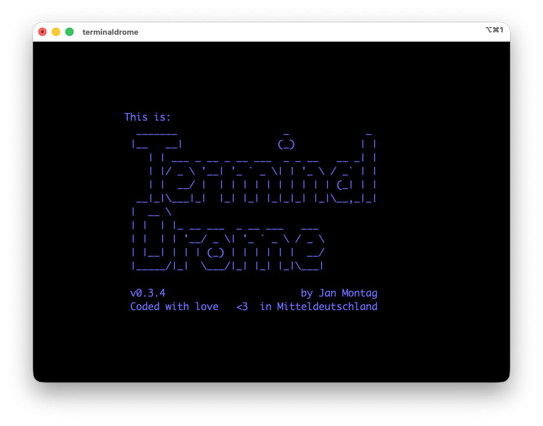
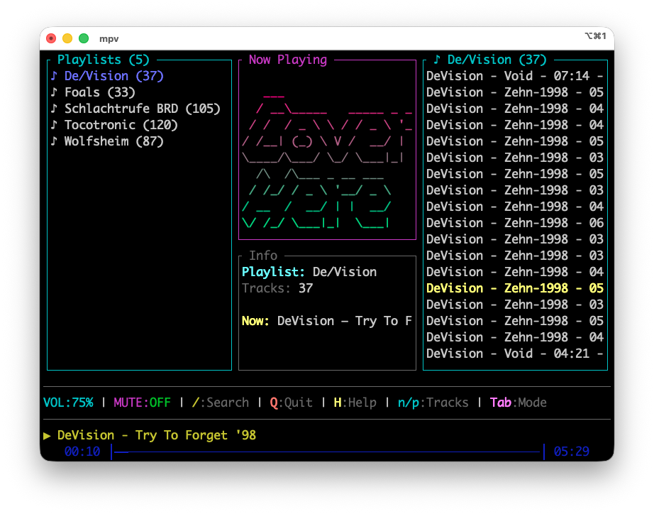

# TerminalDrome



A terminal-based music client for [Navidrome](https://www.navidrome.org/) (and other Subsonic-compatible servers), written in Rust.

```
    _______                  _             _
   |__   __|                (_)           | |
      | | ___ _ __ _ __ ___  _ _ __   __ _| |
      | |/ _ \ '__| '_ ` _ \| | '_ \ / _` | |
      | |  __/ |  | | | | | | | | | | (_| | |
    __|_|\___|_|  |_| |_| |_|_|_| |_|\__,_|_|
   |  __ \
   | |  | |_ __ ___  _ __ ___   ___
   | |  | | '__/ _ \| '_ ` _ \ / _ \
   | |__| | | | (_) | | | | | |  __/
   |_____/|_|  \___/|_| |_| |_|\___|
                                by Jan Montag
                                version 0.6.0
```

---



## Features

### What's new in 0.6.0
- 🔀 **Shuffle Mode** — press `Shift+S` while in any song list (album, playlist, or Jukebox queue) to instantly shuffle and restart playback. The currently playing song panel and progress bar turn magenta so you always know shuffle is active.

### What was new in 0.5.x
- 🎉 **Party / Jukebox Mode** (`Shift+J`) — streams your entire library in random order. Songs are fetched from the server in batches in the background, so even a library with tens of thousands of tracks works without loading everything into memory at once.

### All Features
- 🎵 Browse artists, albums, and songs from your Navidrome server
- 📋 Playlist support — view and play your playlists
- 🔀 Shuffle any album or playlist with `Shift+S` (Fisher-Yates shuffle, restarts playback from the new order)
- 🎉 Jukebox / Party Mode (`Shift+J`) — infinite random playback of your full library, auto-refilling in the background
- 🖼️ ASCII cover art rendered directly in the terminal
- 🔍 Full-text search across your music library
- ⌨️ Keyboard-driven navigation with quick A–Z jump
- 🔊 Volume control (`+` / `-`) and mute toggle (`m`)
- ⏭️ Next / previous track (`n` / `p`), stop (`Space`)
- 📡 Scrobbling support — marks songs as played in Navidrome
- 🔒 Token-based auth (Subsonic API ≥ 1.13.0 — your password is never sent in plaintext)
- 💾 Persistent state — remembers your last position between sessions

---

## Requirements

- A running [Navidrome](https://www.navidrome.org/) instance (or any Subsonic-compatible server)
- [mpv](https://mpv.io/) installed and available in your `$PATH`
- Rust toolchain (for building from source)

### Install mpv

**macOS:**
```bash
brew install mpv
```

**Linux (Debian/Ubuntu):**
```bash
sudo apt install mpv
```

**Linux (Arch):**
```bash
sudo pacman -S mpv
```

---

## Installation

### From source

```bash
git clone https://github.com/thafaker/terminaldrome
cd terminaldrome
cargo build --release
./target/release/terminaldrome
```

### Install system-wide

```bash
cargo install --path .
```

After that, just run:
```bash
terminaldrome
```

### From crates.io

```bash
cargo install terminaldrome
```

---

## Configuration

TerminalDrome looks for a config file in the following locations (in order):

1. `./config.toml` (current directory)
2. `~/.config/TerminalDrome/config.toml` (Linux/macOS)

Create the config file with the following content:

```toml
[server]
url      = "https://your-navidrome-server.com"
username = "your-username"
password = "your-password"
```

---

## Keyboard Shortcuts

### Navigation

| Key | Action |
|-----|--------|
| `↑` / `↓` | Move selection up / down |
| `←` / `→` | Switch between views (Artists → Albums → Songs) |
| `Enter` | Confirm selection / start playback |
| `Tab` | Toggle between Artists and Playlists view |
| `A`–`Z` | Quick jump to first entry starting with that letter |

### Playback

| Key | Action |
|-----|--------|
| `Space` | Stop playback |
| `n` | Next track |
| `p` | Previous track |
| `+` / `=` | Volume up |
| `-` | Volume down |
| `m` | Toggle mute |
| `Shift+S` | Shuffle current album / playlist / Jukebox queue and restart |

### Modes

| Key | Action |
|-----|--------|
| `Shift+J` | Start Jukebox / Party Mode (random playback of entire library) |
| `ESC` | Exit Jukebox Mode and return to Artists |

### Other

| Key | Action |
|-----|--------|
| `/` | Search |
| `Shift+H` | Show help screen |
| `Shift+Q` | Quit |

---

## Visual Indicators

| Indicator | Meaning |
|-----------|---------|
| `🔀 SHUFFLE` in status bar | Shuffle mode is active — song list has been randomised |
| `🎉 JUKEBOX` in status bar | Jukebox / Party Mode is running |
| **Magenta** progress bar & song info | Shuffle mode |
| **Green** progress bar & song info | Jukebox mode |

---

## How it works

TerminalDrome communicates with your Navidrome server via the [Subsonic API](http://www.subsonic.org/pages/api.jsp). Audio playback is handled by **mpv**, which is launched as a background process and controlled via a Unix socket. This keeps the TUI responsive while mpv handles all the audio decoding and streaming.

Authentication uses token-based auth (MD5 hash of password + random salt), so your password never appears in plaintext in process lists or logs.

**Shuffle** works entirely client-side: the current song list is shuffled in memory (Fisher-Yates algorithm) and mpv is restarted with the new order from the beginning.

**Jukebox Mode** uses Navidrome's `getRandomSongs` endpoint to fetch songs in batches of ~50. As playback approaches the end of the current batch, new songs are loaded in the background and appended to the mpv playlist via IPC. Songs already played are trimmed from memory to keep RAM usage low, even for very large libraries.

---

## License

MIT — see [LICENSE](LICENSE)

---

*Done with love ♥ in Mitteldeutschland by Jan Montag*