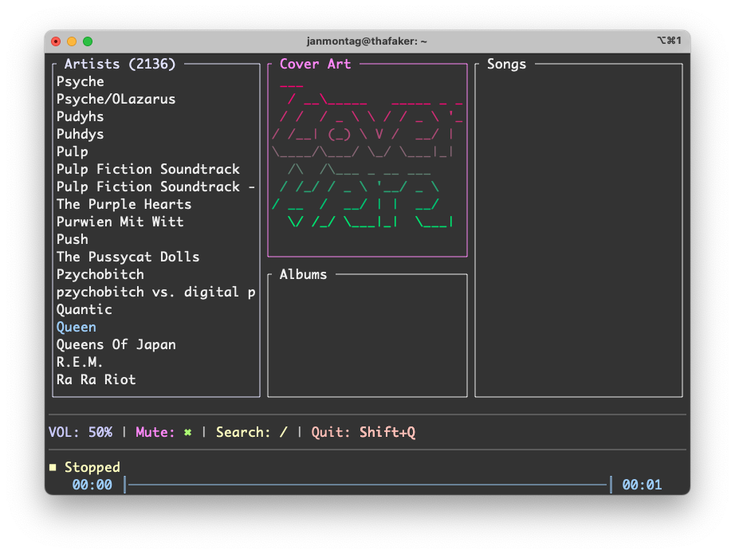
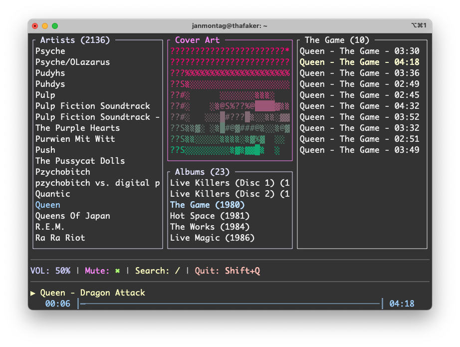
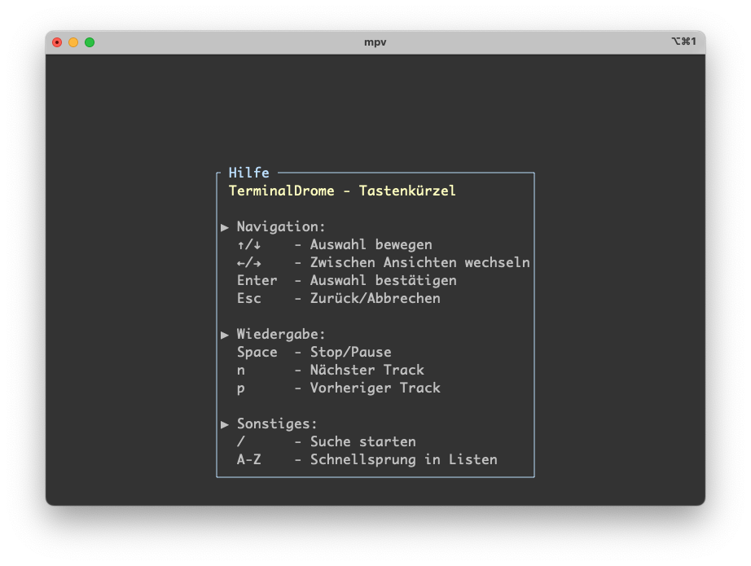
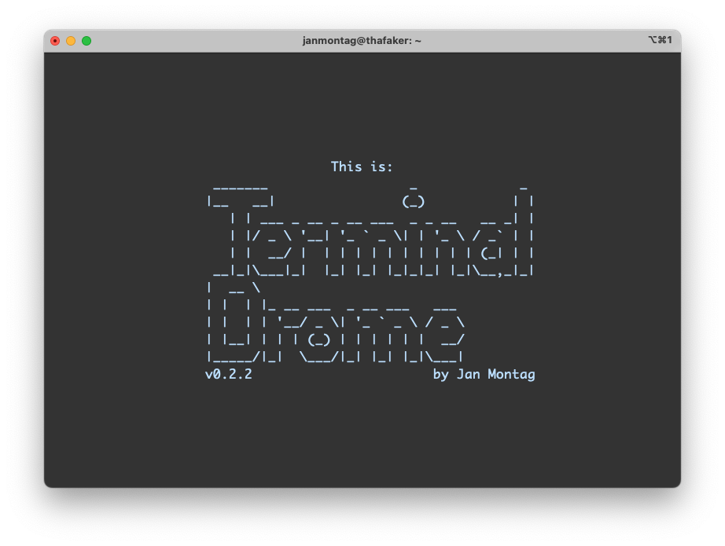
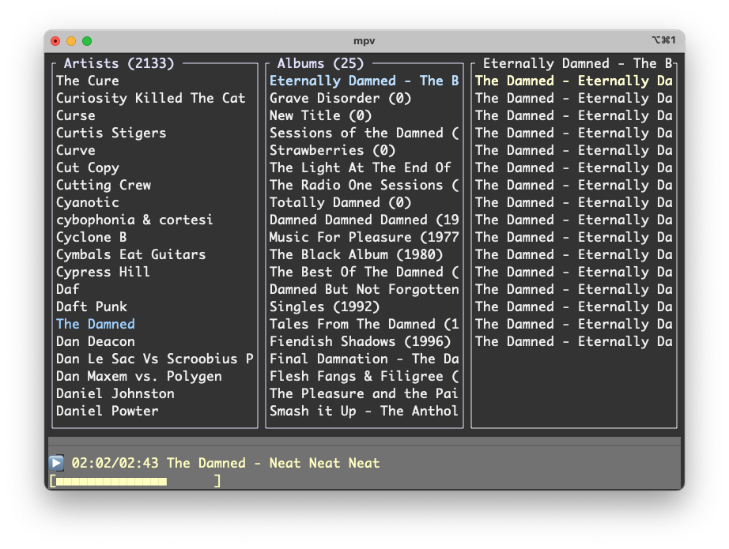

# TerminalDrome – Terminal-based Navidrome Client v0.2.3 (English)

  


**TerminalDrome** is a lightweight **Subsonic** *API-compatible* music client for terminal environments, optimized for older hardware such as the [PowerMac G5](https://apfelhammer.de/images/pmg5_smol.jpeg).

## What has changed in Version 0.2.3?
### 0.2.3 – Stability & Cross-Architecture Improvements, not visibile.
#### Fixed
* Fixed duplicate selection decrement in navigation logic (on_up)
* Fixed potential division-by-zero in progress bar calculation
* Hardened time position handling against invalid/NaN values
* Improved atomic memory ordering for weak memory architectures (ARM, PPC64)
* Prevented uncontrolled async task spawning during album rendering
* Improved mpv IPC reconnect handling
* Improved temporary directory handling for macOS and Linux

#### Improved
* Switched to single-thread Tokio runtime for better determinism
* Reduced async task churn in render path
* Improved cross-platform stability (Linux PPC64, Linux x86_64, macOS Intel, macOS ARM)
* Better behavior on weak memory-order CPUs
* Reduced CPU load during cover rendering

#### Platform Stability
Tested on:
* Linux PPC64
* Linux x86_64
* macOS Intel
* macOS ARM (Apple Silicon via Homebrew)

## Short build instruction
Clone the repo to your hard drive:
```bash
git clone https://github.com/thafaker/TerminalDrome.git
```
change to directory
```bash
cd TerminalDrome
```
next copy the template to config:
```bash
cp config.toml.template config.toml
```
edit the config file with your favourite editor of choice (nano):
```bash
nano config.toml
```
edit your personal navidrome increditiens:
```bash
# terminaldrome/config.toml.template
[server]
url = "https://your-navidrome-server.com"
username = "your username"
password = "your password"
```
Safe that file and start building your navidrome client:
```bash
cargo run
```
Depending on your hardware lasts the build a little bit longer or fewer, I think on modern machines 20 Seconds, on the powermac g5 a lot longer.
That's all for today.

---

🔧 [Build Instructions here](https://github.com/thafaker/termnavi/tree/main?tab=readme-ov-file#-build-with-cargo)!

Now, we have a somehow Cover-Integration. It is downloading the cover, reverting to ASCII and showing it :-)



This is TerminalDrome:



We now have a HELP Screen. While in TerminalDrome, press SHift+H and the following Help-Screen appears! 



We now have a Start Splash Screen <3 and I love it!



## Status
* Absolute pre-alpha!!!
* if search phrase is not a result, TerminalDrome crashes.
* Scrobbling to last.fm and listen.brainz works via Navidrome
* Track updates while playing. Once a song finishes, it automatically switches to the next one and updates the display accordingly.
* A basic full-text search is implemented: press the slash `/` key to open the search window, enter a term, and the results will appear in the third pane.
* Basic Help Screen via Shift+H Button.
* Splash Start Screen :-)
* nice Status Bar at the bottom
* Cover Art in the middle Pane, downloading the cover and converting it to ascii.

## Benchmarking :-)

Benchmarking <code>cargo build --release</code>

| Powermac G5     | Mac mini M4 | arm V7 hf |
|-----------------|-------------|------------
| real	11m0,929s | real 113,67s| real 20m18,682s |
| user	20m26,256s| user 8,30s  | user 72m37,270s |
| sys	0m49,419s | system 17,416| sys 1m30,860s |

## ✨ Key Features of TerminalDrome

1. Navidrome Integration  
    * Connects to your Navidrome server (HTTPS enforced)  
    * Supports all Subsonic API endpoints (Artists, Albums, Songs)

2. TUI (Terminal UI) with 3-column layout  
    * Artists → Albums → Songs  
    * Intuitive navigation using arrow keys  
    * Colored highlights (active songs, selection, status)

3. Music Playback  
    * MPV integration (runs silently in the background)  
    * Automatic transition to the next song (playlist mode)  
    * Play/pause with spacebar  
    * Progress bar and time display

4. Last.fm Scrobbling  
    * Automatically scrobbles at ~50% of the song duration  
    * Correct timestamps (Unix milliseconds)  
    * Avoids duplicates (via `current_scrobble_sent` flag)

5. Persistence  
    * Saves last state (`state.json`)  
        * Current artist/album/song  
        * Scroll positions  
        * Now-playing index  
    * Stable MPV communication  
    * Unix socket for real-time updates (playlist position, time)  
    * Correct handling of playlist end  
    * Minimal status bar  
    * Displays current song + album/artist  
    * Clear error messages (e.g. for connection problems)

## 🔧 Technical Highlights

* Written in Rust (fast & safe)  
* Async/await for non-blocking I/O  
* Atomic operations for thread-safe state (MPV ↔ UI)  
* TOML configuration (server URL, credentials)

## 🚀 Roadmap Ideas (optional)

* Search filtering in lists  
* Shuffle/repeat modes  
* Cover art (via Sixel or ASCII art)  
* Theme support (color schemes)

## 🖥️ Compatibility

| System          | Arch     | Status      |
|-----------------|----------|-------------|
| PowerMac G5     | ppc64    | ✅ Tested   |
| Raspberry Pi 4  | aarch64  | ✅ Tested   |
| Modern Laptops  | x86-64   | ✅ Tested   |
| Mac mini M4     | arm64    | ✅ Tested   |
| macOS 12.6      | arm64    | ✅ Tested   |

## 📦 Installation

### Requirements

- **MPV** (v0.34+ recommended)  
- **Rust toolchain** (only if building from source)

#### MPV installation via package manager

| Distribution        | Command                     |
|---------------------|-----------------------------|
| Ubuntu/Debian       | `sudo apt install mpv`      |
| Arch Linux/Manjaro  | `sudo pacman -S mpv`        |
| Fedora/RHEL         | `sudo dnf install mpv`      |
| openSUSE            | `sudo zypper install mpv`   |
| macOS (Homebrew)    | `brew install mpv`          |
| Void Linux          | `sudo xbps-install mpv`     |

#### 🔧 Build with Cargo

```bash
git clone https://github.com/thafaker/termnavi.git TerminalDrome

cd TerminalDrome
#either
cargo run
# or
cargo build --release
```

After that, you need to setup your server config. Create a file named config.toml (vi config.toml or nano config.toml) in your home directory in .config/config.toml or for cargo run in your TerminalDrome directory and 

```bash
# Linux/macOS
~/.config/terminaldrome/config.toml

# Windows
%APPDATA%\TerminalDrome\config.toml
```

edit the following specs:

```bash

[server]
url = "your navidrome server url"
username = "user"
password = "pass"

[player]
use_mpv = true
experimental_audio = false

```

Thats all. While in TerminalDrome Directory, simply <code>cargo run</code> and TerminalDrome should appear and shows your Navidrome Files. Have fun.

---

# TerminalDrome - Terminalbasierter Navidrome Client (Deutsch)


**TerminalDrome** ist ein schlanker Subsonic-API-kompatibler Musikclient für Terminal-Umgebungen, optimiert für ältere Hardware wie den [PowerMac G5](https://apfelhammer.de/images/pmg5_smol.jpeg). 



## Stand:
* absolute pre Alpha!!!
* Scrobbling zu last.fm und listen.brainz funktioniert über Navidrome
* Titel aktualisiert sich beim Spielen. Ist ein Song zu Ende wechselt er automatisch zum nächsten Song und zeigt dies auch an. Update Zeit und Song funktioniert.
* Wir haben eine ganz rudimentäre Volltextsuche implementiert: wenn man Slash / drückt, öffnet sich die Suche: hier gibt man etwas ein und im dritten Pane wird das Ergebnis angezeigt. 

## ✨ Hauptfeatures von TerminalDrome

1. Navidrome-Integration
	* Verbindung zu deinem Navidrome-Server (HTTPS-erzwungen)
	* Unterstützt alle Subsonic-API-Endpoints (Artists, Albums, Songs)
2. TUI (Terminal UI) mit 3-Spalten-Design
	* Artists → Albums → Songs
	* Intuitive Navigation mit Pfeiltasten
	* Farbige Hervorhebungen (aktive Songs, Auswahl, Status)
3. Musikwiedergabe
	* MPV-Integration (lautlos im Hintergrund)
	* Automatischer Übergang zum nächsten Song (Playlist-Modus)
	* Play/Pause mit Leertaste
	* Fortschrittsbalken und Laufzeitanzeige
4. Last.fm-Scrobbling
	* Automatisches Scrobbeln bei ~50% der Songdauer
	* Korrekte Zeitstempel (Unix-Millisekunden)
	* Vermeidung von Duplikaten (via current_scrobble_sent-Flag)
5. Persistenz
	* Speichert den letzten Zustand (state.json):
	* Aktueller Künstler/Album/Song
	* Scroll-Positionen
	* Now-Playing-Index
	* Stabile MPV-Kommunikation
	* Unix-Socket für Echtzeit-Updates (Playlist-Position, Zeit)
	* Behandelt Playlist-Ende korrekt
	* Minimalistische Statusleiste
	* Anzeige des aktuellen Songs + Album/Artist
	* Klare Fehlermeldungen (z. B. bei Verbindungsproblemen)

## 🔧 Technische Highlights

* Rust-basiert (schnell & sicher)
* Async/await für non-blocking I/O
* Atomic Operations für Thread-sicheren Status (MPV ↔ UI)
* TOML-Konfiguration (Server-URL, Credentials)

## 🚀 Roadmap-Ideen (optional)

* Suche (Filterfunktion in Listen)
* Shuffle/Repeat-Modi
* Cover-Art (via Sixel oder ASCII-Art)
* Theme-Unterstützung (farbige Schemes)

## 🖥️ Kompatibilität
| System          | Arch     | Status      |
|-----------------|----------|-------------|
| PowerMac G5     | ppc64    | ✅ Stabil   |
| Raspberry Pi 4  | aarch64  | ✅ Stabil   |
| Moderne Laptops | x86-64   | ✅ Getestet |
| Mac mini M4 	  | arm64    | ✅ Getestet |

## 📦 Installation

### Voraussetzungen
- **MPV** (mind. 0.34+)
- **Rust Toolchain** (nur für Eigenkompilierung)

#### Paketmanager-Installation MPV:
| Distribution | Befehl |
|--------------|--------|
| Ubuntu/Debian | `sudo apt install mpv` |
| Arch Linux/Manjaro | `sudo pacman -S mpv` |
| Fedora/RHEL | `sudo dnf install mpv` |
| openSUSE | `sudo zypper install mpv` |
| macOS (Homebrew) | `brew install mpv` |
| Void Linux | `sudo xbps-install mpv` |

#### Build with cargo in path

```bash
git clone https://github.com/thafaker/termnavi.git TerminalDrome

cd TerminalDrome

cargo build --release
```

### Binaries (empfohlen)

Laden Sie vorkompilierte Versionen für Ihr System von den [Releases](https://github.com/thafaker/termnavi/releases):
