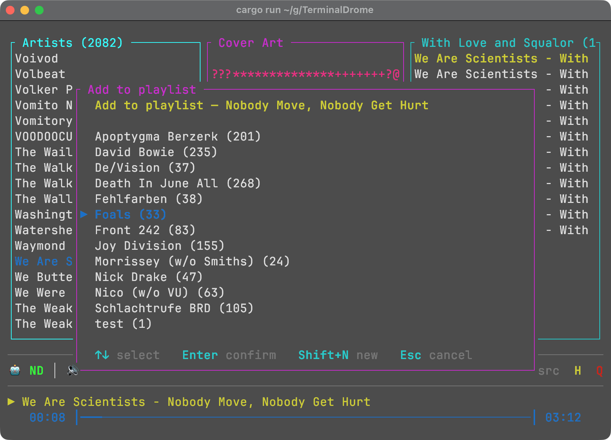

# TerminalDrome



A terminal-based music client for [Navidrome](https://www.navidrome.org/) (and other Subsonic-compatible servers) and Bandcamp, written in Rust.

```
    _______                  _             _
   |__   __|                (_)           | |
      | | ___ _ __ _ __ ___  _ _ __   __ _| |
      | |/ _ \ '__| '_ ` _ \| | '_ \ / _` | |
      | |  __/ |  | | | | | | | | | | (_| | |
    __|_|\___|_|  |_| |_| |_|_|_| |_|\__,_|_|
   |  __ \  edit Playlists for the win
   | |  | |_ __ ___  _ __ ___   ___
   | |  | | '__/ _ \| '_ ` _ \ / _ \
   | |__| | | | (_) | | | | | |  __/
   |_____/|_|  \___/|_| |_| |_|\___|
                                by Jan Montag
                                version 0.9.0
```

---

## Getting Started with TerminalDrome

I wrote a "Getting Started with TerminalDrome: A First-Time Users Guide" ([Link](https://apfelhammer.de/posts/getting_started_with_terminaldrome/)) on how to configure TerminalDrome and how it works.

## Features

### New in 0.9.0

- 📋 **Playlist management** — TerminalDrome is no longer read-only. You can now create playlists, add songs to them, and remove individual tracks.
  - Press `a` while any song is playing to open the playlist picker.
  - Press `Shift+N` inside the picker to create a new playlist on the fly — the current song is added automatically.
  - Press `d` in the playlist view to remove the selected song from the playlist.
  - Works with both Navidrome and Bandcamp backends.
- 🖥 **Fullscreen help** — the help screen (`Shift+H`) now uses the entire terminal and splits into two columns, so every shortcut fits comfortably even on an 80×24 terminal.
- 📏 **Context-sensitive status bar** — the bottom line shows only the keys that apply to the current view. Universal keys (`H`, `Q`) stay right-aligned at all times.

### New in 0.8.6
- 🎼 **Song info overlay** — press `Shift+I` to see bitrate, format, file size,
  path, server play count, and a local play counter that TerminalDrome maintains
  itself across sessions. Works for both Navidrome and Bandcamp.
- 📊 **Local play counter** — TerminalDrome now tracks how often you've played
  each song in its own state file, independent of the server. Useful when the
  backend (e.g. Bandcamp) doesn't provide a `playCount` field.
- 📏 **Compact status bar** — the bottom bar is now context-sensitive: it only
  shows the keys that actually do something in the current view, so the whole
  TUI stays usable on an 80×25 terminal.

### New in 0.8.5

- 🎸 **Bandcamp support** — switch between Navidrome/Subsonic and a Bandcamp-compatible server with `Shift+B`.
- 🔐 **Secure first-time setup** — if credentials are missing or still placeholders, TerminalDrome asks for them interactively at startup.
- 🧾 **CLI arguments** — `--config <FILE>`, `--server <URL>`, `--user <USERNAME>` (plus the usual `--help` and `--version`).
- 🔑 **Local token derivation** — your password is hashed together with a random salt and stored only as `token` + `salt`. **The plaintext never touches the disk**.
- ⚙️ **Optional Bandcamp config** — can be enabled via `[bandcamp]` in `config.toml`.

### All Features

- 📋 **Playlist editing** — create playlists, add and remove tracks from inside the TUI
- 🎼 Song info overlay (`Shift+I`) with bitrate, format, file size, and play counts
- 📊 Local play counter — tracks your plays across sessions, per source
- 🎵 Browse artists, albums, and songs from your Navidrome server
- 🎸 Optional Bandcamp source (Subsonic-compatible endpoint)
- 🔀 Shuffle any album or playlist with `Shift+S` (Fisher-Yates shuffle, restarts playback from the new order)
- 🎉 Jukebox / Party Mode (`Shift+J`) — infinite random playback of your full library, auto-refilling in the background
- 🖼️ ASCII cover art rendered directly in the terminal
- 🔍 Full-text search across your music library
- ⌨️ Keyboard-driven navigation with quick A–Z jump
- 🔊 Volume control (`+` / `-`) and mute toggle (`m`)
- ⏭️ Next / previous track (`n` / `p`), stop (`Space`)
- ❤️ Like songs (`Shift+L`)
- 📡 Scrobbling support — marks songs as played in Navidrome
- 🔒 Token-based auth (Subsonic API ≥ 1.13.0 — your password is never sent in plaintext)
- 💾 Persistent state — remembers your last position between sessions
- 🎛️ Source switching — `Shift+B` toggles between Navidrome and Bandcamp

---

## Security & Token Auth

TerminalDrome authenticates against the Subsonic API using the standard token scheme: token = md5(password + salt). When you enter your Navidrome password during first-time setup, TerminalDrome generates a random salt, computes the token locally, and stores only the resulting token + salt in config.toml. **Your plain-text password is never written to disk**.

Navidrome does not offer dedicated "App Tokens" that you generate in the web UI.

### How it works

1. On first start (or whenever credentials are missing / still contain placeholder values), TerminalDrome prompts for:
   - Server URL
   - Username
   - Password
2. The entered secret is combined with a freshly generated random salt and hashed with MD5:
   ```
   token = MD5(password + salt)
   ```
3. Only `token` and `salt` are written to `config.toml`. The plaintext password is discarded and **never stored**.
4. On Unix systems the config file is saved with `600` permissions.

You do **not** need to visit any website to generate a token. The derivation happens entirely on your machine. All you have to do is enter your normal Navidrome password when prompted.

### Optional: Navidrome App Tokens

If you'd rather not type your account password into a terminal at all, you can create a Navidrome **App Token** and enter *that* as the "password" when TerminalDrome asks for it. TerminalDrome will then hash the App Token the same way (MD5 + salt) and use the result as the Subsonic token.

To create one:

1. Log into your **Navidrome** web interface.
2. Go to **Personal Settings** → **Personal Access Tokens**.
3. Create a new token for `TerminalDrome`.
4. When TerminalDrome asks for your password, paste the App Token instead.

This is purely optional — a normal account password works just as well, and TerminalDrome never writes it to disk either way.

---

## Requirements

- A running [Navidrome](https://www.navidrome.org/) instance (or any Subsonic-compatible server)
- Optional: Bandcamp now supports Subsonic with an endpoint (server URL https://bandcamp.com/api/subsonic) With credentials you can use Bandcamp in TerminalDrome
- [mpv](https://mpv.io/) installed and available in your `$PATH`
- (Optional) [cava](https://github.com/karlstav/cava) for the audio visualizer backend
- Rust toolchain (for building from source)

### Install mpv

**macOS:**
```bash
brew install mpv
```

**Linux (Debian/Ubuntu):**
```bash
sudo apt install mpv
```

**Linux (Arch):**
```bash
sudo pacman -S mpv
```

### (Optional) Install cava (Visualizer backend)

If you want the visualizer to react to real audio, install `cava`.

**Linux (Arch):**
```bash
sudo pacman -S cava
```

---

## Installation

### From source

```bash
git clone https://github.com/thafaker/terminaldrome
cd terminaldrome
cargo build --release
./target/release/terminaldrome
```

### Install system-wide

```bash
cargo install --path .
```

After that, just run:

```bash
terminaldrome
```

### From crates.io

```bash
cargo install terminaldrome
```

---

## Configuration

TerminalDrome looks for a config file in the following locations (in order):

1. `./config.toml` (current directory)
2. OS-specific config directory, e.g.:
   - Linux: `~/.config/terminaldrome/config.toml`
   - macOS: `~/Library/Application Support/terminaldrome/config.toml`

You can also point TerminalDrome at a specific file with `--config <FILE>`.

A minimal `config.toml` looks like this:

```toml
[server]
url      = "https://your-navidrome-server.com"
username = "your-username"
# password = "your-password"   # optional; only needed if you want to skip the interactive prompt
# token    = "..."             # derived automatically from password/app token
# salt     = "..."             # derived automatically from password/app token
```

If the file is missing or credentials are still placeholders, TerminalDrome launches an interactive setup on the next start and writes the resulting `token` + `salt` back to disk.

Optional Bandcamp source:

```toml
[bandcamp]
enabled  = false
url      = "https://bandcamp.com/api/subsonic"
username = "your_username"
token    = "your_token"
```

To get started, go to [Fan Settings](http://bandcamp.com/settings?pane=fan), scroll down to Subsonic, and generate your credentials. You can then add Bandcamp as a Subsonic or OpenSubsonic server in your Subsonic client with the server URL https://bandcamp.com/api/subsonic.

---

## CLI Usage

```bash
terminaldrome --help
```

Available arguments:

| Argument | Description |
|----------|-------------|
| `--config <FILE>` | Path to configuration file |
| `--server <URL>` | Subsonic server URL (overrides config) |
| `--user <USERNAME>` | Username (overrides config) |
| `--help` | Show help |
| `--version` | Show version |

Example:

```bash
terminaldrome --server https://music.example.com --user jan
```

---

## Keyboard Shortcuts

### Navigation

| Key | Action |
|-----|--------|
| `↑` / `↓` | Move selection up / down |
| `←` / `→` | Switch between views (Artists → Albums → Songs) |
| `Enter` | Confirm selection / start playback |
| `Tab` | Toggle between Artists and Playlists view |
| `A`–`Z` | Quick jump to first entry starting with that letter |

### Playback

| Key | Action |
|-----|--------|
| `Space` | Stop playback |
| `n` | Next track |
| `p` | Previous track |
| `+` / `=` | Volume up |
| `-` | Volume down |
| `m` | Toggle mute |
| `Shift+S` | Shuffle current album / playlist / Jukebox queue and restart |
| `Shift+L` | ❤️ Like current song |

### Playlists

| Key	| Action |
|-----|--------|
| `a`	  | Add currently playing song to a playlist |
| `Shift+N` |	Create a new playlist (inside the picker) |
| `d`	  | Remove selected song from the open playlist |

### Modes

| Key | Action |
|-----|--------|
| `Shift+B` | Toggle music source (Navidrome ↔ Bandcamp) |
| `Shift+J` | Start Jukebox / Party Mode (random playback of entire library) |
| `Shift+E` | Toggle fullscreen audio visualizer |
| `ESC` | Exit Jukebox Mode and return to Artists (also closes the Visualizer) |

### Other

| Key | Action |
|-----|--------|
| `/` | Search |
| `Shift+H` | Show help screen |
| `Shift+Q` | Quit |
| `Shift+I` | Show song info (bitrate, format, play count, …) |

---

## Visual Indicators

| Indicator | Meaning |
|-----------|---------|
| `🤖 ND` in status bar | Active source is Navidrome |
| `🎸 BC` in status bar | Active source is Bandcamp |
| `🔊50%` in status bar | Current volume |
| `🔇 muted` in status bar | Audio is muted |
| `🔀 SHUFFLE` in status bar | Shuffle mode is active |
| `🎉 JUKEBOX` in status bar | Jukebox / Party Mode is running |
| **Magenta** progress bar & song info | Shuffle mode |
| **Green** progress bar & song info | Jukebox mode |
| `❤️` next to a song title | Song is liked/favorited |

The bottom status bar is **context-sensitive**: it shows only the shortcuts
that apply to the current view. Universal keys (`H`, `Q`) stay right-aligned
at all times; everything in between changes as you switch modes.

---

## How it works

TerminalDrome communicates with your Navidrome server via the [Subsonic API](http://www.subsonic.org/pages/api.jsp). Audio playback is handled by **mpv**, which is launched as a background process and controlled via a Unix socket. This keeps the TUI responsive while mpv handles all the audio decoding and streaming.

Authentication uses token-based auth. When you enter your password during setup, TerminalDrome derives a random salt, computes `MD5(secret + salt)`, and stores only the resulting `token` and `salt`. From then on, every request to the server carries `t=<token>&s=<salt>` — the plaintext secret never appears in process lists, logs, or on disk.

Bandcamp support uses an optional second `[bandcamp]` server block. Press `Shift+B` to switch sources.

**Shuffle** works entirely client-side: the current song list is shuffled in memory (Fisher-Yates algorithm) and mpv is restarted with the new order from the beginning.

**Jukebox Mode** uses Navidrome's `getRandomSongs` endpoint to fetch songs in batches of ~50. As playback approaches the end of the current batch, new songs are loaded in the background and appended to the mpv playlist via IPC. Songs already played are trimmed from memory to keep RAM usage low, even for very large libraries.

**Visualizer** (`Shift+E`) is a fullscreen 8-bar overlay. If `cava` is installed, TerminalDrome uses it as the audio backend; otherwise it falls back to a demo animation.

**Local play counts** are stored in `state.json` alongside the rest of your
session data, keyed by `<source>:<song_id>` so the same track on Navidrome and
Bandcamp is counted separately. This works even when the server has no
`playCount` support — for example on Bandcamp bridges that only implement the
read-only subset of the Subsonic API.

---

### Roadmap

* 1.0 — Queue support: Play next and Add to queue for on-the-fly listening.
After that, TerminalDrome is feature-complete.

---

## License

MIT — see [LICENSE](LICENSE)

---

*Done with love ♥ in Mitteldeutschland by Jan Montag*

[TerminalDrome.de](https://terminaldrome.de)
